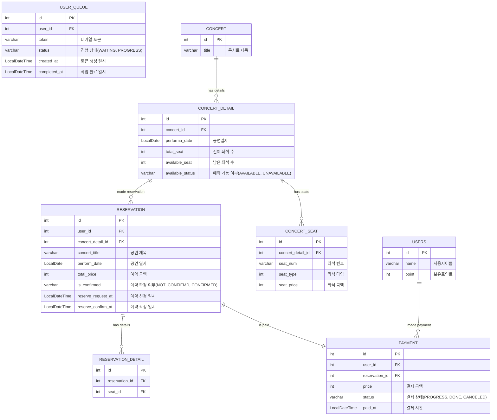

** ERD **

```mermaid
erDiagram
    USERS {
        int id PK
        varchar name "사용자이름"
        int point "보유포인트"
    }

    USER_QUEUE {
        int id PK 
        int user_id FK
        varchar token "대기열 토큰"
        varchar status "진행 상태(WAITING, PROGRESS)"
        LocalDateTime created_at "토큰 생성 일시"
        LocalDateTime completed_at "작업 완료 일시"
    }

    CONCERT {
        int id PK
        varchar title "콘서트 제목"
    }

    CONCERT_DETAIL {
        int id PK
        int concert_Id FK 
        LocalDate performa_date "공연일자"
        int total_seat "전체 좌석 수"
        int available_seat "남은 좌석 수"
        varchar available_status "예약 가능 여부(AVAILABLE, UNAVAILABLE)"
    }

    CONCERT_SEAT {
        int id PK
        int concert_detail_id FK
        varchar seat_num "좌석 번호"
        int seat_type "좌석 타입"
        int seat_price "좌석 금액"
    }

    RESERVATION {
        int id PK
        int user_id FK
        int concert_detail_id FK
        varchar concert_title "공연 제목"
        LocalDate perform_date "공연 일자"
        int total_price "예약 금액"
        varchar is_confirmed "예약 확정 여부(NOT_CONFIEMD, CONFIRMED)"
        LocalDateTime reserve_request_at "예약 신청 일시"
        LocalDateTime reserve_confirm_at "예약 확정 일시"
    }

    RESERVATION_DETAIL {
        int id PK
        int reservation_id FK
        int seat_id FK
    }

    PAYMENT {
        int id PK
        int user_id FK
        int reservation_id FK
        int price "결제 금액"
        varchar status "결제 상태(PROGRESS, DONE, CANCELED)"
        LocalDateTime paid_at "결제 시간"
    }

    RESERVATION ||--o{ RESERVATION_DETAIL: "has details"
    RESERVATION ||--|| PAYMENT: "is paid"
    USERS ||--o{ PAYMENT: "made payment"
    CONCERT ||--o{ CONCERT_DETAIL: "has details"
    CONCERT_DETAIL ||--o{ CONCERT_SEAT: "has seats"
    CONCERT_DETAIL ||--o{ RESERVATION: "made reservation"
```
