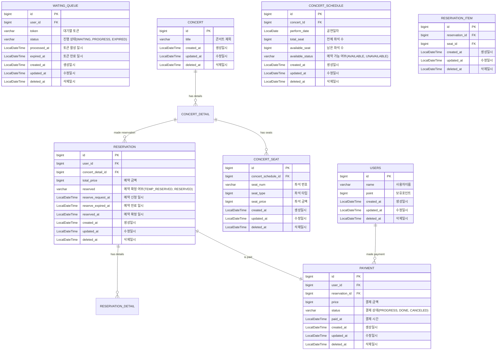

** ERD **

```mermaid
erDiagram
    USERS {
        bigint id PK
        varchar name "사용자이름"
        bigint point "보유포인트"
        LocalDateTime created_at "생성일시"
        LocalDateTime updated_at "수정일시"
        LocalDateTime deleted_at "삭제일시"  
    }

    WATING_QUEUE {
        bigint id PK 
        bigint user_id FK
        varchar token "대기열 토큰"
        varchar status "진행 상태(WAITING, PROGRESS, EXPIRED)"
        LocalDateTime processed_at "토큰 활성 일시"
        LocalDateTime expired_at "토큰 만료 일시"
        LocalDateTime created_at "생성일시"
        LocalDateTime updated_at "수정일시"
        LocalDateTime deleted_at "삭제일시"  
    }

    CONCERT {
        bigint id PK
        varchar title "콘서트 제목"
        LocalDateTime created_at "생성일시"
        LocalDateTime updated_at "수정일시"
        LocalDateTime deleted_at "삭제일시"   
    }

    CONCERT_SCHEDULE {
        bigint id PK
        bigint concert_Id FK 
        LocalDate perform_date "공연일자" 
        bigint total_seat "전체 좌석 수" 
        bigint available_seat "남은 좌석 수"
        varchar available_status "예약 가능 여부(AVAILABLE, UNAVAILABLE)"
        LocalDateTime created_at "생성일시"
        LocalDateTime updated_at "수정일시"
        LocalDateTime deleted_at "삭제일시"  
    }

    CONCERT_SEAT {
        bigint id PK
        bigint concert_schedule_id FK
        varchar seat_num "좌석 번호"
        bigint seat_type "좌석 타입"
        bigint seat_price "좌석 금액"
        LocalDateTime created_at "생성일시"
        LocalDateTime updated_at "수정일시"
        LocalDateTime deleted_at "삭제일시"  
    }

    RESERVATION {
        bigint id PK
        bigint user_id FK
        bigint concert_detail_id FK
        bigint total_price "예약 금액"
        varchar reserved "예약 확정 여부(TEMP_RESERVED, RESERVED)"
        LocalDateTime reserve_request_at "예약 신청 일시"
        LocalDateTime reserve_expired_at "예약 만료 일시"
        LocalDateTime reserved_at "예약 확정 일시"
        LocalDateTime created_at "생성일시"
        LocalDateTime updated_at "수정일시"
        LocalDateTime deleted_at "삭제일시"  
    }

    RESERVATION_ITEM {
        bigint id PK
        bigint reservation_id FK
        bigint seat_id FK
        LocalDateTime created_at "생성일시"
        LocalDateTime updated_at "수정일시"
        LocalDateTime deleted_at "삭제일시"  
    }

    PAYMENT {
        bigint id PK
        bigint user_id FK
        bigint reservation_id FK
        bigint price "결제 금액"
        varchar status "결제 상태(PROGRESS, DONE, CANCELED)"
        LocalDateTime paid_at "결제 시간"
        LocalDateTime created_at "생성일시"
        LocalDateTime updated_at "수정일시"
        LocalDateTime deleted_at "삭제일시"  
    }

    RESERVATION ||--o{ RESERVATION_DETAIL: "has details"
    RESERVATION ||--|| PAYMENT: "is paid"
    USERS ||--o{ PAYMENT: "made payment"
    CONCERT ||--o{ CONCERT_DETAIL: "has details"
    CONCERT_DETAIL ||--o{ CONCERT_SEAT: "has seats"
    CONCERT_DETAIL ||--o{ RESERVATION: "made reservation"
```
