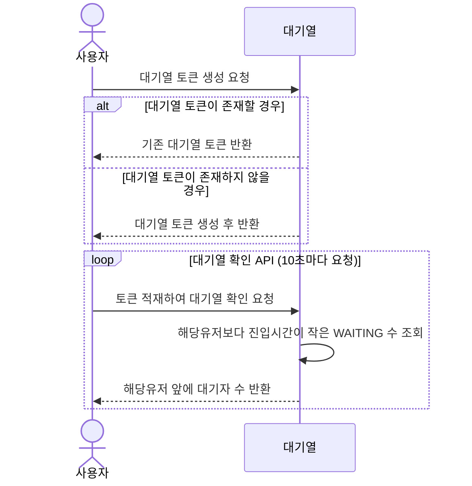
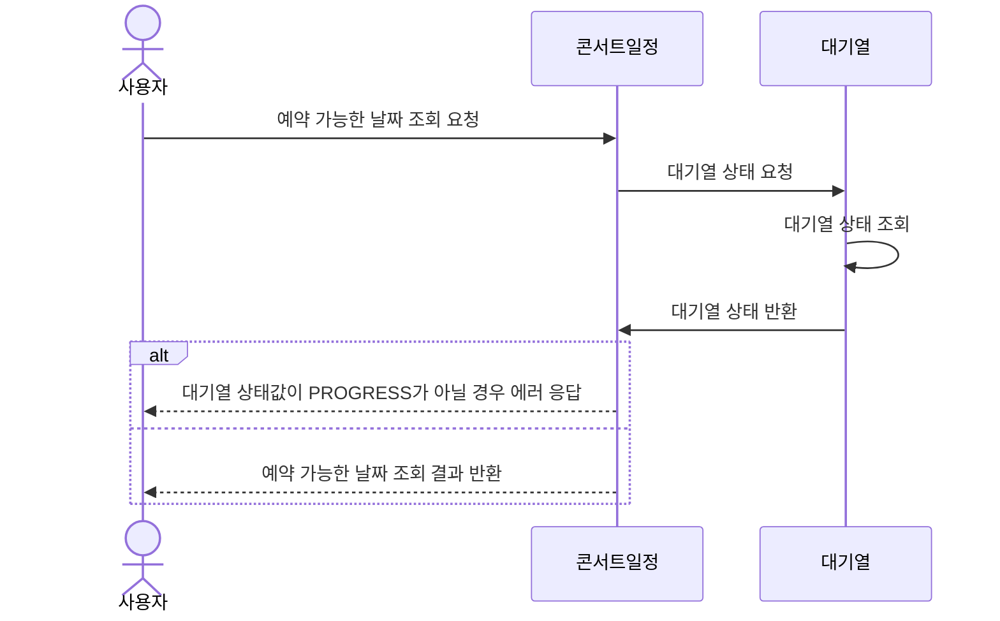
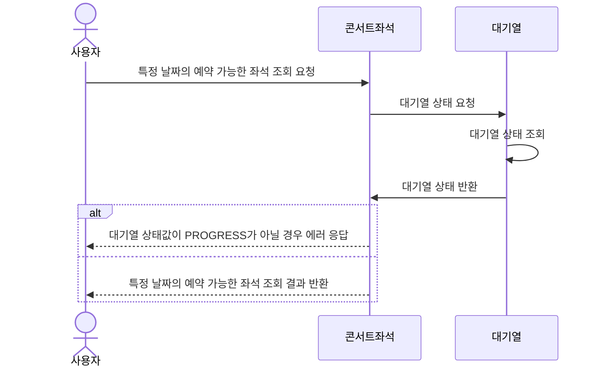
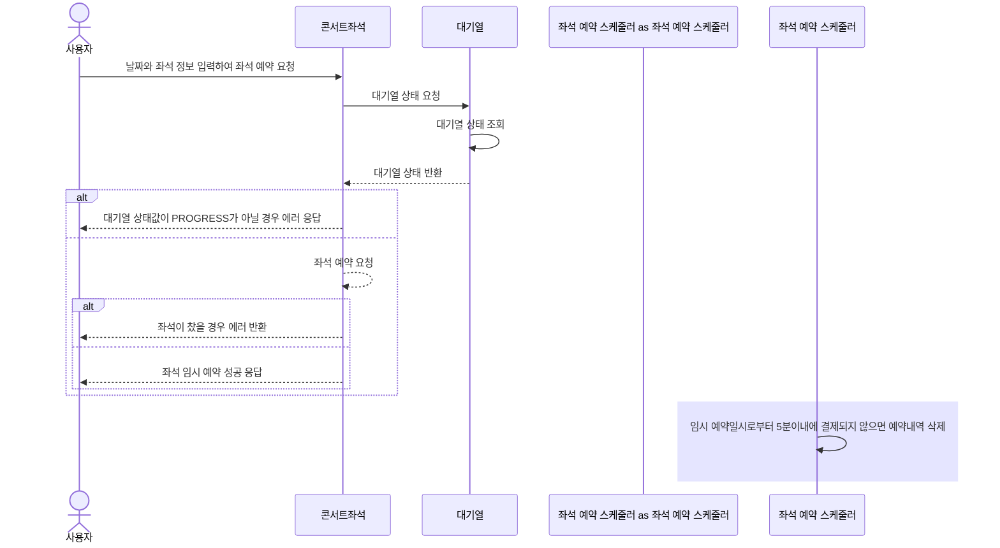
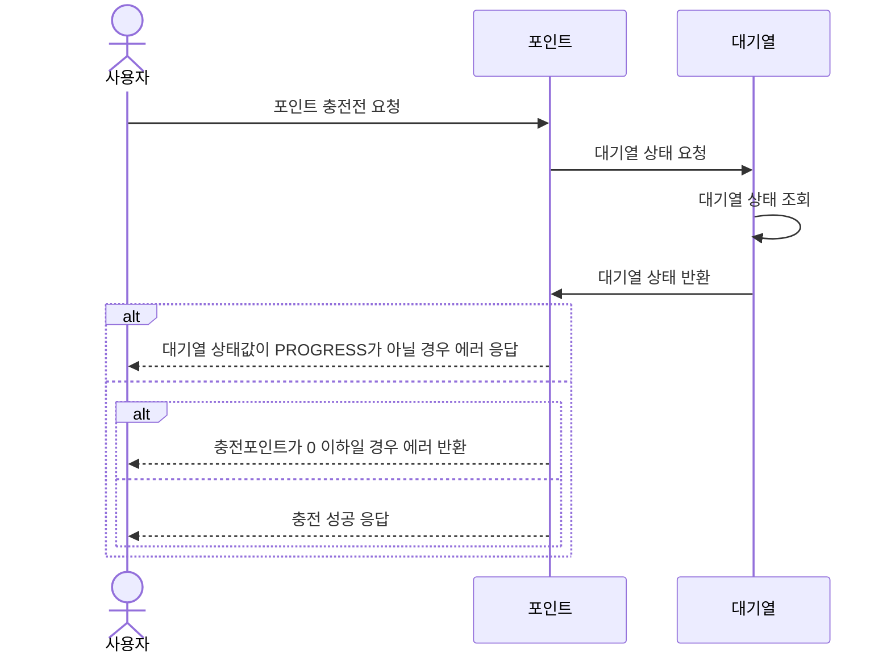
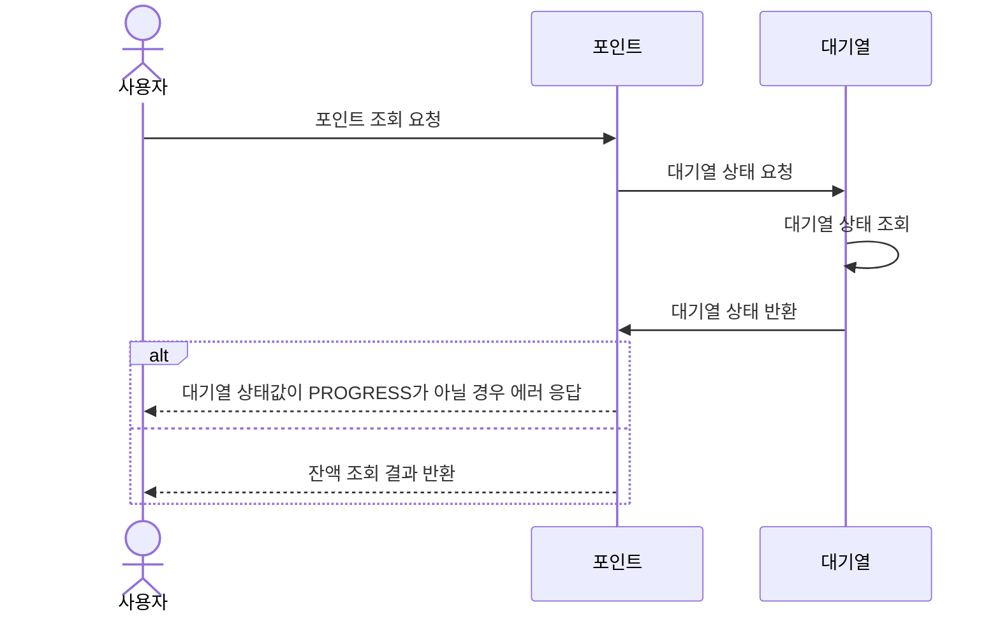
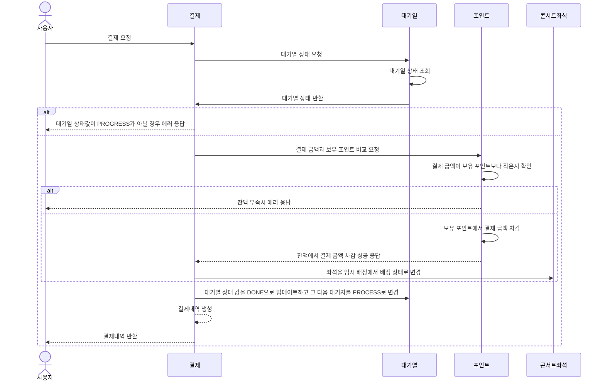

# 시퀀스 다이어그램 

### 1. 유저 대기열 토큰 기능

```mermaid
sequenceDiagram
    actor 사용자 as 사용자
    participant 대기열 as 대기열
    사용자 ->> 대기열: 대기열 토큰 생성 요청
    alt 대기열 토큰이 존재할 경우
        대기열 -->> 사용자: 기존 대기열 토큰 반환
    else 대기열 토큰이 존재하지 않을 경우
        대기열 -->> 사용자: 대기열 토큰 생성 후 반환
    end
    loop 대기열 확인 API (10초마다 요청)
        사용자 ->> 대기열: 토큰 적재하여 대기열 확인 요청
        대기열 ->> 대기열: 해당유저보다 진입시간이 작은 WAITING 수 조회
        대기열 -->> 사용자: 해당유저 앞에 대기자 수 반환
    end
```

### 2. 예약 가능 날짜 조회 API

```mermaid
sequenceDiagram
    actor 사용자 as 사용자
    participant 콘서트일정 as 콘서트일정
    participant 대기열 as 대기열
    사용자 ->> 콘서트일정: 예약 가능한 날짜 조회 요청
    콘서트일정 ->> 대기열: 대기열 상태 요청
    대기열 ->> 대기열: 대기열 상태 조회
    대기열 ->> 콘서트일정: 대기열 상태 반환
    alt
        콘서트일정 -->> 사용자: 대기열 상태값이 PROGRESS가 아닐 경우 에러 응답
    else
        콘서트일정 -->> 사용자: 예약 가능한 날짜 조회 결과 반환
    end
```

### 3. 예약 가능 좌석 조회 API

```mermaid
sequenceDiagram
    actor 사용자 as 사용자
    participant 콘서트좌석 as 콘서트좌석
    participant 대기열 as 대기열
    사용자 ->> 콘서트좌석: 특정 날짜의 예약 가능한 좌석 조회 요청
    콘서트좌석 ->> 대기열: 대기열 상태 요청
    대기열 ->> 대기열: 대기열 상태 조회
    대기열 ->> 콘서트좌석: 대기열 상태 반환
    alt
        콘서트좌석 -->> 사용자: 대기열 상태값이 PROGRESS가 아닐 경우 에러 응답
    else
        콘서트좌석 -->> 사용자: 특정 날짜의 예약 가능한 좌석 조회 결과 반환
    end
```

### 4. 좌석 예약 API

```mermaid
sequenceDiagram
    actor 사용자 as 사용자
    participant 콘서트좌석 as 콘서트좌석
    participant 대기열 as 대기열
    participant 좌석 예약 스케줄러 as 좌석 예약 스케줄러
    사용자 ->> 콘서트좌석: 날짜와 좌석 정보 입력하여 좌석 예약 요청
    콘서트좌석 ->> 대기열: 대기열 상태 요청
    대기열 ->> 대기열: 대기열 상태 조회
    대기열 -->> 콘서트좌석: 대기열 상태 반환
    alt
        콘서트좌석 -->> 사용자: 대기열 상태값이 PROGRESS가 아닐 경우 에러 응답
    else
        콘서트좌석 -->> 콘서트좌석 : 좌석 예약 요청
        alt
          콘서트좌석 -->> 사용자: 좌석이 찼을 경우 에러 반환
        else
          콘서트좌석 -->> 사용자: 좌석 임시 예약 성공 응답
        end
    end
    rect rgba(0, 0, 255, .1)
        좌석 예약 스케줄러 ->> 좌석 예약 스케줄러 : 임시 예약일시로부터 5분이내에 결제되지 않으면 예약내역 삭제
    end
```

### 5. 잔액 충전 API

```mermaid
sequenceDiagram
    actor 사용자 as 사용자
    participant 포인트 as 포인트
    participant 대기열 as 대기열
    사용자 ->> 포인트: 포인트 충전전 요청
    포인트 ->> 대기열: 대기열 상태 요청
    대기열 ->> 대기열: 대기열 상태 조회
    대기열 ->> 포인트: 대기열 상태 반환
    alt
        포인트 -->> 사용자: 대기열 상태값이 PROGRESS가 아닐 경우 에러 응답
    else
      alt
          포인트 -->> 사용자: 충전포인트가 0 이하일 경우 에러 반환
      else
          포인트 -->> 사용자: 충전 성공 응답
      end
    end
```

### 6. 잔액 조회 API

```mermaid
sequenceDiagram
    actor 사용자 as 사용자
    participant 포인트 as 포인트
    participant 대기열 as 대기열
    사용자 ->> 포인트: 포인트 조회 요청
    포인트 ->> 대기열: 대기열 상태 요청
    대기열 ->> 대기열: 대기열 상태 조회
    대기열 ->> 포인트: 대기열 상태 반환
    alt
       포인트 -->> 사용자: 대기열 상태값이 PROGRESS가 아닐 경우 에러 응답
    else
       포인트 -->> 사용자: 잔액 조회 결과 반환
    end
```

### 7. 결제 API

```mermaid
sequenceDiagram
    actor 사용자 as 사용자
    participant 결제 as 결제
    participant 대기열 as 대기열
    participant 포인트 as 포인트
    participant 콘서트좌석 as 콘서트좌석
    사용자 ->> 결제: 결제 요청
    결제 ->> 대기열: 대기열 상태 요청
    대기열 ->> 대기열: 대기열 상태 조회
    대기열 ->> 결제: 대기열 상태 반환
    alt
        결제 -->> 사용자: 대기열 상태값이 PROGRESS가 아닐 경우 에러 응답
    else
        결제 ->> 포인트: 결제 금액과 보유 포인트 비교 요청
        포인트 ->> 포인트: 결제 금액이 보유 포인트보다 작은지 확인
        alt
          포인트 -->> 사용자: 잔액 부족시 에러 응답
        else
          포인트 ->> 포인트: 보유 포인트에서 결제 금액 차감
          포인트 -->> 결제: 잔액에서 결제 금액 차감 성공 응답
          결제 ->> 콘서트좌석: 좌석을 임시 배정에서 배정 상태로 변경
        end
        결제 ->> 대기열: 대기열 상태 값을 DONE으로 업데이트하고 그 다음 대기자를 PROCESS로 변경
        결제 -->> 결제: 결제내역 생성
        결제 -->> 사용자: 결제내역 반환
    end
```
